<p align="center">
  <strong>Aura</strong> — live captions + sound alerts on Apple Vision Pro · <strong>100% on-device</strong>
  <br />
  <sub>24 h hackathon · LA Tech Week / USC ISI · Oct 2025 · <strong>2nd place</strong></sub>
</p>

<p align="center">
  <a href="https://www.youtube.com/watch?v=3KEH2BCODBo"></a>
  &nbsp;
  <a href="https://www.youtube.com/watch?v=HbW9F2zjmLQ"></a>
  &nbsp;
  <a href="https://www.youtube.com/clip/UgkxpRDpwatHZPRf5Oyjow0mAWBwYbVKn7rI"></a>
</p>

---

## ▶ Start here

| | |
|:---:|:---|
| <a href="https://www.youtube.com/watch?v=3KEH2BCODBo">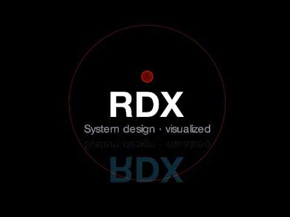<br /><sub><b>System design walkthrough</b><br />~9 min · Manim + VO</sub></a> | What we built, rejected, and why — architecture postmortem with Swift snippets |
| <a href="https://www.youtube.com/watch?v=HbW9F2zjmLQ">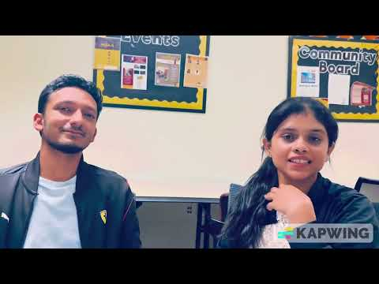<br /><sub><b>Hackathon demo</b><br />~2:37 · Vision Pro</sub></a> | Teammates present · live captions · siren · clapping · locale swap |
| <a href="https://www.youtube.com/clip/UgkxpRDpwatHZPRf5Oyjow0mAWBwYbVKn7rI">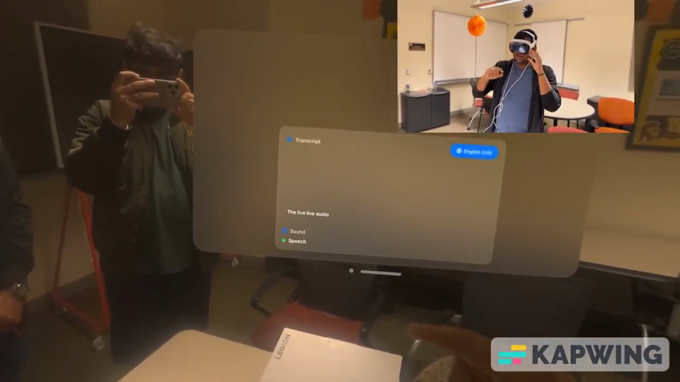<br /><sub><b>60 s highlight</b></sub></a> | Quick recruiter cut |

---

## On Vision Pro

<p align="center">
  
  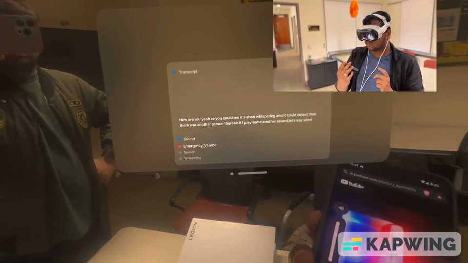
  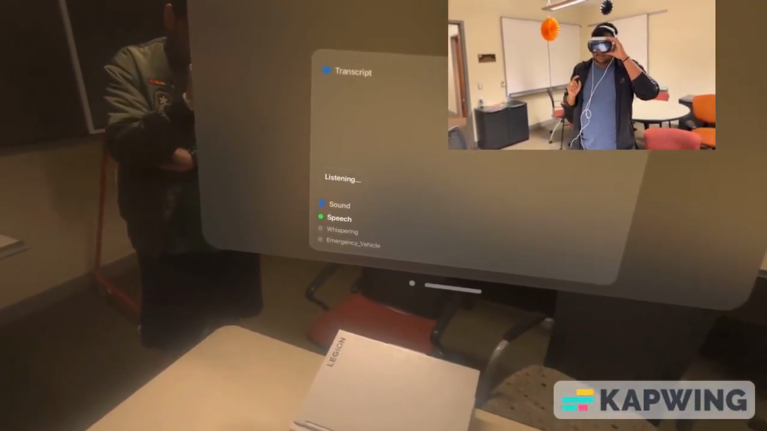
</p>

<p align="center">
  <b>Live captions</b> &nbsp;·&nbsp; <b>Sound alerts</b> (siren → emergency vehicle) &nbsp;·&nbsp; <b>7 locales</b> without restart
</p>

---

## From the design video

Frames from [the walkthrough](https://www.youtube.com/watch?v=3KEH2BCODBo) — click through on YouTube for chapters.

<p align="center">
  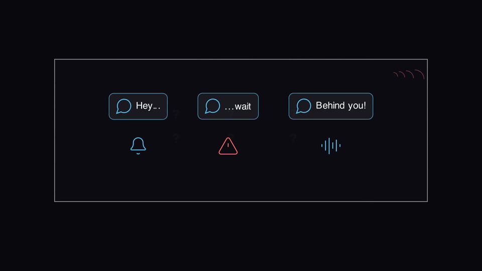
  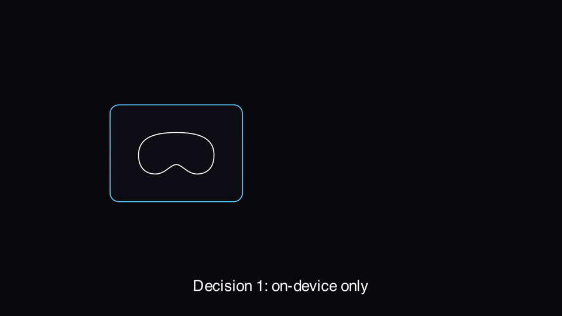
</p>

<p align="center">
  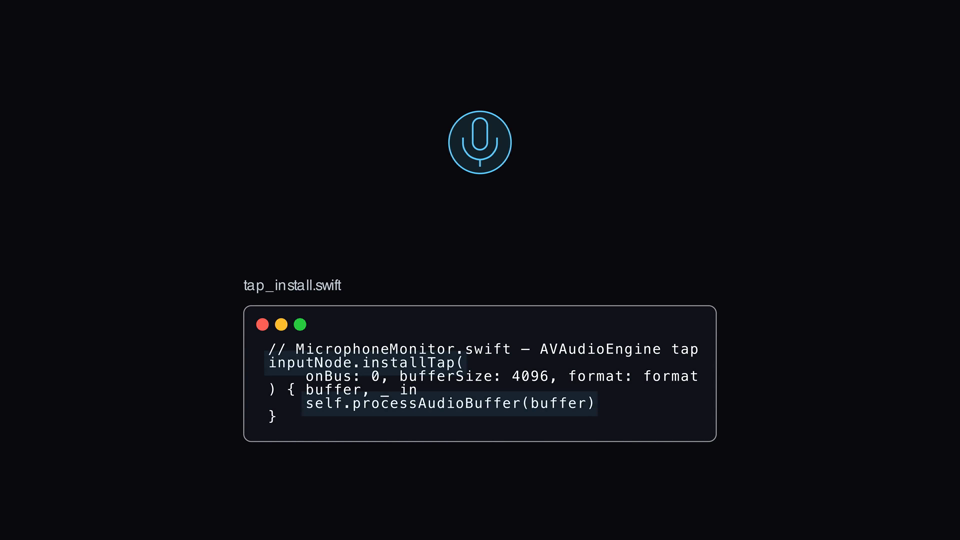
  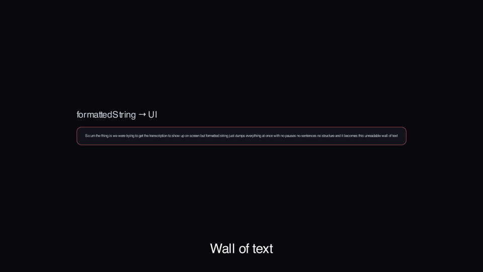
</p>

<p align="center">
  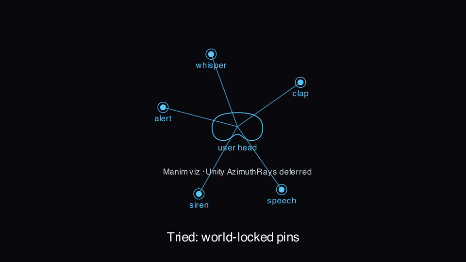
  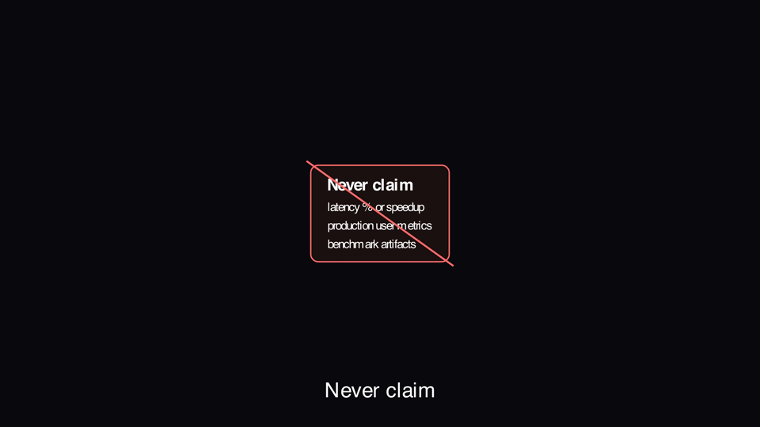
</p>

---

## Under the hood

<p align="center">
  
</p>

<p align="center">
  One mic tap → Speech + SoundAnalysis · serial analysis queue · MainActor UI bridge
  <br />
  <code>MicrophoneMonitor.swift</code> · <code>ContentView.swift</code> · <code>ImmersiveView.swift</code>
</p>

<p align="center">
  Swift · SwiftUI · visionOS · RealityKit · AVFoundation · Speech · SoundAnalysis
  <br />
  <sub>No external dependencies · Apple's on-device models (integrated, not trained)</sub>
</p>

---

## Run it

```
git clone https://github.com/RDX-Rajat-Savdekar/Aura-Vision-Pro
open Aura.xcodeproj
# Run on visionOS Simulator or Vision Pro · allow Mic + Speech
```

---

## Context

| | |
|---|---|
| **Built in** | ~24 h · Oct 2025 |
| **Coded by** | Rajat Savdekar |
| **Presented by** | Fardeen Khan · Namratha V Patil |
| **Status** | Hackathon prototype — not production |

Manim source for the walkthrough: [Manim-DSA-SD-Concepts / Aura/design-video](https://github.com/RDX-Rajat-Savdekar/Manim-DSA-SD-Concepts/tree/main/Aura/design-video)

---

<p align="center">
  <sub>LA Tech Week · USC ISI · Lovable</sub>
</p>
